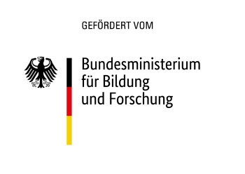

<!--

author:   Sarah Briese

email:    sarah.briese@ovgu.de

version:  0.0.1

language: de

narrator: Deutsch Female

comment:  Digitaler Wegweiser zur didaktischen Planung studentischer Teamarbeit in Lehrveranstaltungen der Informatik.

link:     custom.css

icon: https://www.dip-it.ovgu.de/dipit_media/Bilder/Marginalbereich/Logo_DiP_iT_wei%C3%9F-height-230-width-230-p-74.png

-->

# Digitaler Wegweiser: Didaktische Planung studentischer Teamarbeit in Lehrveranstaltungen der Informatik 

Sie wollen eine Lehrveranstaltung konzipieren oder weiterentwickeln, in der Studierende kooperativ oder kollaborativ lernen sollen?
Im Folgenden werden Sie Schritt für Schritt durch den Planungsprozess geleitet.
In Schritt 1-3 geht es um die Analyse von Vorbedingungen für Ihre didaktischen Entscheidungen.
In Schritt 4-8 geht es um konkrete didaktische Entscheidungen zur Gestaltung der Gruppenarbeit.
Dabei ist jeder Planungsschritt in drei Unterkapitel untergliedert: (1) was sagt die Forschung, (2) was sind unsere Empfehlungen, (3) ein Beispiel zur Umsetzung.

## Problemdarstellung 

Teamfähigkeit wird einerseits als eine essentielle Kompetenz für Informatiker:innen beschrieben, andererseits zeigen sich in Forschungsarbeiten immer wieder Lücken zwischen den Anforderungen der (Software-)Industrie und den in der Hochschulbildung erworbenen Kompetenzen der Absolvent:innen (Garousi et al., 2019; Radermacher, & Walia, 2013).
Es zeichnet sich ein Bedarf an einer diesbezüglichen Weiterentwicklung von Aufgaben, Lehrveranstaltungen und Curricula an Hochschulen ab.
Tatsächlich ist kooperatives und kollaboratives Lernen für Studierende und Lehrende eine Herausforderung.
Teamarbeit erfordert ein hohes Maß an koordinativem und kommunikativem Aufwand und auch emotionaler Anstrengung der Studierenden (Järvelä et al., 2016) und ist oftmals zeitaufwendiger in der Durchführung (Hannay, Dyba, Arisholm, & Sjberg, 2009).
Lehrende hingegen verfügen oft nicht über die entsprechenden Kompetenzen für die didaktische Gestaltung kollaborativer und kooperativer Lehr-Lern-Szenarien (Veldman, Van Kuijk, Doolaard, & Bosker, 2020).
Zugleich deuten die Ergebnisse von Studien darauf hin, dass systematisch didaktisch geplante kollaborative und kooperative Lehr-Lern-Szenarien zu besseren Leistungen der Lernenden führen, als Szenarien, in denen lediglich Tools für Teamarbeit bereitgestellt werden und die konkrete Umsetzung den Lernenden überlassen wird (Borokhovski et al., 2016).

## Ziele des Projekts DiP-iT

Zielstellung des Projekts DiP-iT „Digitales Programmieren im Team“[^1] war vor diesem Hintergrund die Entwicklung eines digitalen Fachkonzepts zur Integration von Teamarbeit in die Lehre.
**Mittels unseres digitalen Wegweisers zur Implementierung von Teamarbeit in Lehrveranstaltungen sollen Lehrende dabei unterstützt werden, diesbezügliche didaktische Analysen und didaktische Designentscheidungen zu treffen.**
Die Strukturierung der Handlungsfelder zu didaktischen Entscheidungen wurde über die Entwicklung eines didaktischen Modells erreicht.
Diesbezügliche Handlungsempfehlungen werden auf der Basis empirischer Forschungsergebnisse des genannten Projektes gegeben.

Unter Teamarbeit werden in diesem Artikel sowohl kooperative als auch kollaborative Lehr-Lernformen verortet.
Kooperatives Lernen zeichnet sich dadurch aus, dass eine Aufgabe zwischen den Teammitgliedern aufgeteilt wird, die Lernenden bearbeiten Aufgabenbestandteile individuell und fügen die Ergebnisse am Schluss zu einem Teamprodukt zusammen.
Kollaboratives Lernen fokussiert dagegen auf die gemeinsame Arbeit an einer Aufgabe in einem koordinierten Gruppenarbeitsprozess (Roschelle, & Teasley, 1995).

 

**Exkurs: Vorgehen in DiP-iT**

Unser empirisches Vorgehen bei der Entwicklung des digitalen Fachkonzepts ist durch mehrere, teilweise parallel ablaufende, teilweise aufeinander aufbauende Studien gekennzeichnet.

Zunächst haben wir __(1)__ die aktuelle Praxis von Teamarbeit in Grundlagenlehrveranstaltungen zum Programmieren erhoben, um Ansatzpunkte für Weiterentwicklung zu identifizieren.
Mittels qualitativer Interviews mit Lehrenden und Studierenden an drei Hochschulen – Humboldt Universität zu Berlin, Otto-von-Guericke Universität Magdeburg und TU Bergakademie Freiberg haben wir untersucht, welche Formen der Teamarbeit in Lehrveranstaltungen umgesetzt werden, welche Ziele damit verbunden sind und wie Teamarbeit durchgeführt und bewertet wird.
Auch die Herausforderungen mit denen Lehrende und Lernende dabei konfrontiert sind, wurden erhoben (Schulz, Berndt, & Hawlitschek, 2022).
In ergänzenden quantitativen Befragungen mit Studierenden an den drei Hochschulen wurden der Einsatz der identifizierten Formen der Teamarbeit in Lehrveranstaltungen, die Wahrnehmungen zu Chancen und Herausforderungen und die Wünsche der Studierenden zur Verbesserung der Teamarbeit in Lehrveranstaltungen noch einmal mit einer größeren Studierendenzahl eruiert (Berndt et al., 2023).
Unsere Studien zeigen, dass Teamarbeit und die damit verbundenen Fähigkeiten an den Hochschulen als wichtige Kompetenzen wahrgenommen werden.
Lehrende beschreiben Teamarbeit jedoch zugleich als Mittel zur Senkung von Korrektur- und Betreuungsaufwand.
Entsprechend erfährt Teamarbeit selten eine systematische didaktische Planung und Anleitung, vielmehr wird die konkrete Umsetzung oftmals den Studierenden überlassen.
In den umgesetzten Lehr-Lern-Szenarien werden vorwiegend kooperative Formen der Teamarbeit umgesetzt, kollaborative Teamarbeit ist deutlich seltener.
Eine große Mehrheit der Studierenden wünscht sich aber explizit eine umfangreichere didaktische Anleitung und Unterstützung der Teamarbeit durch Lehrende (Schulz, Berndt, & Hawlitschek, 2022).

Anschließend haben wir __(2)__ mittels einer quantitativen Befragung von Mitarbeitenden untersucht, welche Bedarfe hinsichtlich Teamfähigkeiten in IT-Unternehmen vorhanden sind (Berndt et al., 2023).
Die Ergebnisse unterstreichen die Bedeutung der Teamarbeit für die Arbeitswelt und die unzureichende Abdeckung des Themas in universitären Lehrveranstaltungen.
Der sogenannte „academia-industry gap“ hinsichtlich der Teamfähigkeiten der Absolventen und der Bedarfe der IT-Unternehmen (Garousi et al., 2019) ist auch in unserer Studie manifest: Beschäftigte in IT-Unternehmen konstatieren eine steigende Bedeutung von Teamarbeit, fühlen sich jedoch durch das Studium nur selten gut auf die Anforderungen an Teamfähigkeiten in der Praxis vorbereitet.
Sie wünschen sich eine Anpassung von kooperativen und kollaborativen Lehr-Lernpraxen an die Bedarfe der Arbeitswelt.

Mittels eines systematischen Literaturreviews zu Pair Programming an Hochschulen haben wir __(3)__ evidenzbasierte Handlungsempfehlungen zum didaktischen Design dieser kollaborativen Form des Programmierens erhoben (Hawlitschek, Berndt, & Schulz, 2022).
Für den Fokus auf Pair Programming haben wir uns vor dem Hintergrund entschieden, dass Pair Programming in der Befragung der Unternehmensmitarbeitenden eine steigende Relevanz zugeschrieben wurde, diese kollaborative Form jedoch sehr selten an Hochschulen genutzt wird (Berndt et al., 2023).
Mittels des Literaturreviews konnten wir Erkenntnisse zur Gruppenbildung, zur Strukturierung der Teamarbeit und zur Relevanz der didaktischen Anleitung gewinnen.
Diese lassen sich teilweise auf andere kollaborative Programmierformen übertragen.

Auf der Grundlage unserer Erkenntnisse haben wir __(4)__ ein didaktisches Modell zur Planung von Teamarbeit in Grundlagenveranstaltungen der Informatik entwickelt (Hawlitschek, Berndt, & Schulz, 2021).
Ausgehend von didaktischen Analysen zu Lehr-Lernzielen, Lernendencharakteristika und Rahmenbedingungen werden hier didaktische Designentscheidungen zur Gruppenbildung, zu Lernaktivitäten und zur Strukturierung der Zusammenarbeit abgeleitet.

In Lehrveranstaltungen an der TU Bergakademie Freiberg und der Otto-von-Guericke Universität wurden __(5)__ konkrete Szenarien zur Integration von Teamarbeit in die Lehre erprobt.
Hierbei konnten wir zeigen, dass eine Aufforderung zur Teambildung und zur Teamarbeit und die Bereitstellung einer Arbeitsumgebung hierfür keine effektive Zusammenarbeit garantiert, zumal Studierende negative Erfahrungen mit und Vorbehalte gegenüber Teamarbeit berichten (Hawlitschek, Rudolf, & Zug, 2021).
Die didaktische Planung auf der Grundlage des entwickelten didaktischen Modells führte zu einer Intensivierung von Teamarbeit in der Lehrveranstaltung (Hawlitschek, Rudolf, & Zug, 2022a).
Hierbei erwiesen sich sogenannte Collaboration Scripts als vielversprechende Strukturierungsform.

Aus den gebündelten Forschungsergebnissen des Projekts haben wir diese Schritt-für-Schritt-Anleitung zur didaktischen Planung von Teamarbeit entwickelt, die Lehrende für ihre Lehrveranstaltungsplanung nutzen können.Empfehlungen zur konkreten Gestaltung der Teamarbeit werden auf der Grundlage wissenschaftlicher Studien gegeben.
Dennoch handelt es sich hierbei nur um Empfehlungen – es kann nicht garantiert werden, dass sie für jedes Lehr-Lernszenario und für jede\*n Lehrende\*n funktionieren.
Trotz dieser Limitation wollen wir dazu beitragen, __(1)__ die Integration von Teamarbeit in Grundlagenveranstaltungen der Informatik didaktisch zu verbessern und diese __(2)__ besser an die Bedarfe aus der Arbeitswelt anzupassen.

[^1]: Das Projekt wurde durch die Projektpartner\*innen der TU Bergakademie Freiberg,
      Otto-von-Guericke-Universität Magdeburg und
      Humboldt Uni zu Berlin
      von Februar 2020 bis Januar 2023 im Rahmen der dritten Förderlinie zur digitalen Hochschulbildung gefördert
      (https://www.wihoforschung.de/wihoforschung/de/bmbf-projektfoerderung/foerderlinien/forschung-zur-digitalen-hochschulbildung/dritte-foerderlinie-zur-digitalen-hochschulbildung/dip-it/dip-it.html).

## Teamarbeit in die Lehrveranstaltung integrieren: Schritt für Schritt

Bei der Umsetzung von kollaborativen und kooperativen Lehr-Lernszenarien in Lehrveranstaltungen können drei Phasen unterschieden werden (vgl. Kaendler et al. 2015):
In der Planungsphase treffen Lehrende didaktische Entscheidungen über die Struktur, den Ablauf und die Organisation von Teamarbeit.
Während der Durchführungsphase sind sie für die Anleitung und Unterstützung der Lernenden verantwortlich.
In der Reflexionsphase wird die praktische Umsetzung evaluiert und Verbesserungsmöglichkeiten identifiziert.
Im Folgenden konzentrieren wir uns auf die Phase der didaktischen Planung der Integration von Teamarbeit in Lehrveranstaltungen.
Bei der Planung von Teamarbeit müssen zunächst didaktische Analysen durchgeführt werden auf deren Grundlage didaktische Entscheidungen getroffen werden können.
In Anlehnung an bestehende didaktische Modelle (Kerres, 2013) lassen sich folgende Analysefelder unterscheiden: die Lehr-Lernziele, die mit der Integration von Teamarbeit verfolgt werden, die Rahmenbedingungen, die sich aus dem Kontext des Lehr-Lernszenarios ergeben und die Lernendencharakteristika.
Didaktische Entscheidungen betreffen die Strukturierung der Zusammenarbeit, die Gruppenbildung, die Lernaktivitäten, die Betreuung der Studierenden und die Prüfungsgestaltung (vgl. Hawlitschek, Berndt, & Schulz, 2021).

!?[Kurzvorstellung der Planungsschritte, Videovortrag aufgenommen im Rahmen der International Conference on Computing Education Research](https://www.dip-it.ovgu.de/dipit_media/Videos/Koli_Calling_with_license-p-124.mp4)

Am konkreten Beispiel
---------------------

Am Beispiel einer Lehrveranstaltung zur Softwareentwicklung, die an der TU Bergakademie Freiberg gehalten wurde, veranschaulichen wir die einzelnen Analyse- und Entscheidungsschritte.
Diese Lehrveranstaltung unterteilt sich in Vorlesung (4 SWS) und Übung (3 SWS) und wird von durchschnittlich 45 Studierenden der Studiengänge Angewandte Informatik, Robotik, Mathematik, Geoinformatik und Geophysik besucht.
Die Übungsgruppen bestehen aus maximal 25 Studierenden.
Die Materialien zur Vorlesung wie auch die Aufgaben der Übung wurden als Open Educational Ressources umgesetzt[^2].

[^2]: https://github.com/ComputerScienceLecturesTUBAF

### Schritt 1: Analyse der Lehr-Lernziele

Im Ersten Schritt sollten Sie mit der Definition bzw. Überarbeitung der Lehr-Lernziele für die Lehrveranstaltung beginnen.
Sie können Lernziele auch als Teil der Lehrveranstaltung partizipativ mit den Studierenden ausformulieren und nur einen Rahmen vorgeben.
Formulieren Sie drei bis sechs konkrete, realistisch erreichbare Lernziele auf unterschiedlichen Niveaustufen bzw. überprüfen Sie die bereits bestehenden Lernziele und passen Sie diese gegebenenfalls an.
Formulieren Sie dabei auch Lehr-Lern-Ziele, die Sie mit Teamarbeit verfolgen.
Die Lernziele sollen transparent machen, was die Studierenden nach erfolgreichem Besuch der Lehrveranstaltung können und welche Kompetenzen sie erworben haben.

__Wichtig ist:__ Besprechen Sie die Lehr-Lernziele mit Ihren Studierenden!
Transparent kommunizierte Lehr-Lernziele wirken sich in vielen Studien positiv auf den Lernerfolg aus (Schneider, & Preckel, 2017).
Eine didaktische Handreichung zur Erstellung und Formulierung von Lehr-Lern-Zielen finden Sie auf der Webseite der TU Dresden unter:

https://tu-dresden.de/mz/ressourcen/dateien/services/e_learning/didaktische-handreichung-formulierung-von-lernzielen-aus-dem-projekt-seco?lang=de 

> Wenn Sie einen konkreten Ausgangspunkt zur Formulierung benötigen, vervollständigen Sie den folgenden Satz: 
>
> _Nach dem Besuch der Lehrveranstaltung sollen die Studierenden in der Lage sein ..._

Nehmen Sie sich Zeit für die Formulierung der Lehr-Lern-Ziele, sie bilden die Grundlage Ihrer späteren didaktischen Entscheidungen zur Gestaltung der Teamarbeit!

#### 🔎 1.1 Lehr-Lernziele am konkreten Beispiel
<!--
icon: https://www.svgrepo.com/show/513325/magnifying-glass.svg
-->

1. Die Studierenden entwickeln ein Verständnis für die Herausforderungen der Koordination von verteiltem Arbeiten in einem Team und zur Implementierung unterschiedlicher Rollen darin.

2. Die Studierenden entwickeln anwendungsbereite Fähigkeiten in Standartwerkzeugen des Versionsmanagements (git) und der kooperativ/kollaborativen Softwareentwicklung (reviews, wikis, actions).

#### 💡 1.2 Unsere Erfahrungen/Tipps 
<!--
icon: https://www.svgrepo.com/show/263143/light-bulb-idea.svg
-->

> Die Bemühungen um die Vermittlung der Konzepte von Teamarbeit müssen einen Eingang in das Gesamtcurriculum des Studienganges finden.
> Ausgehend von anfänglich minimalen Gruppengrößen und ausführlichen Beschreibungen werden in fortgeschrittenen Semestern immer größere Teams für weniger spezifische Vorgaben gebildet.
> Dieser Ansatz muss den Studierenden aber frühzeitig kommuniziert werden, um diese Gesamtintention zu vermitteln.
> Aus der längerfristigen Perspektive ergibt sich eine höhere Motivation sich mit den Herausforderungen der Teamarbeit auseinanderzusetzen und das Bewusstsein, dass die zunächst überschaubaren Herausforderungen in den Zweierteams in kommenden Semestern zu kritischen Faktoren erwachsen, die über den Erfolg oder Misserfolg eines Projektes entscheiden können.

### Schritt 2: Analyse der Rahmenbedingungen für Ihre Lehrveranstaltung
<!--
icon: https://www.svgrepo.com/show/513325/magnifying-glass.svg
-->

Welche Rahmenbedingungen sind hinsichtlich der Integration von Teamarbeit vorgegeben und engen gegebenenfalls Ihren Handlungsspielraum ein?

1. ~Organisatorische Rahmenbedingungen:~

   Welche Vorgaben machen Modulhandbücher und Studien- und Prüfungsordnungen?
   Sind kooperative oder kollaborative Prüfungsformate zulässig?

2. ~Technische Rahmenbedingungen:~

   * Welche Tools für Teamarbeit stehen an Ihrer Hochschule zur Verfügung?
   * Können Sie Ihr Konzept mit den zur Verfügung stehenden Tools umsetzen?
   * Gibt es Ansprechpartner\*innen falls Probleme auftauchen?
   * Verfügen alle Studierenden über die notwendige Hardware zur Umsetzung des Konzepts?

#### 🔎 2.1 Rahmenbedingungen am konkreten Beispiel 
<!--
icon: https://www.svgrepo.com/show/513325/magnifying-glass.svg
-->

Aus den Rahmenbedingungen ergeben sich für unser konkretes Beispiel Einschränkungen hinsichtlich der Prüfungsleistung.
Laut Prüfungsordnung[^3] sind mündliche Prüfungen, Klausuren und alternative Prüfungsleistungen möglich.
Letztere ermöglichen auch protokollierte praktische Leistungen, d.h. Prüfungsleistungen wie Programmierprojekte wären auf dieser Basis möglich.
Laut Prüfungsordnung müssen die Leistungen jedoch individuell zurechenbar sein.
Ein kollaboratives Programmierprojekt als Prüfungsleistung ist demnach nicht zulässig, lediglich kooperative Projekte wären regelkonform.
Allerdings ermöglichen Versionssysteme, wie sie bei der Softwareentwicklung Verwendung finden auch in kollaborativen Ergebnissen eine Zuordnung der Einzelleistungen.
Sofern die Beiträge über den jeweiligen Account der Studierenden eingereicht wurden, könnte ein Bewertungsschema diese personenspezifisch analysieren.

Für die Erfüllung der Lernziele ist die Arbeit mit Git sowie den darauf aufbauenden Entwicklungsplattformen für das Review, die automatische Veröffentlichung und Evaluation unumgänglich.
Ein wichtiges Kriterium für die Auswahl geeigneter Plattformen (GitLab, GitHub, Bitbucket) ist die Handhabbarkeit aus Sicht der Lehrenden.
GitHub bietet mit dem GitHubClassroom[^4] eine übergeordnete Verwaltungsstruktur für studentische Repositories.Aufgaben können sehr komfortabel ausgerollt und in der Kursübersicht zentral eingesehen werden, im Grunde könnte auch eine automatisierte Bewertung anhand eines Testscripts ausgeführt werden.
Dabei werden die Repositories als privat konfiguriert und sind dadurch nur für die Lehrenden und die Gruppenmitglieder einsehbar.

[^3]: Vgl. https://tu-freiberg.de/sites/default/files/media/innerer-dienst-8539/2020_51_1_bachelor_angewandte_informatik.pdf 
[^4]: https://classroom.github.com/

#### 💡 2.2 Unsere Erfahrungen/Tipps
<!--
icon: https://www.svgrepo.com/show/263143/light-bulb-idea.svg
-->

> Ermuntern Sie die Studierenden nicht die persönlichen Accounts für die webbasierten Entwicklungstools zu verwenden, sondern kurzlebige „Arbeitsaccounts“ für die Lehrveranstaltungen, die keine persönlichen Informationen umfassen, anzulegen.
> Damit bleibt die Identität der Studierenden geschützt, gleichzeitig kann aber die Handhabung realistischer Werkzeuge erprobt werden.

### Schritt 3: Analyse der Zielgruppe

**Welche Lernendencharakteristika sind für die Umsetzung zu beachten?**

Überlegen Sie, welche Charakteristika der Lernenden für die erfolgreiche Umsetzung der Teamarbeit berücksichtigt werden müssen.
Fragen Sie sich beispielsweise, über welche Kompetenzen in der Teamarbeit Ihre Studierenden verfügen.
Sie könne dazu auch eine Kurzumfrage starten, z.B. mittels der Umfragetools im Lern-Management-System (z.B. Moodle, ILIAS, OLAT) Ihrer Hochschule oder einer Papierbefragung in der ersten Veranstaltungswoche.
Wenn die Studierenden wenig Erfahrung in der Teamarbeit bzw. in der in Ihrer Lehrveranstaltung umgesetzten Form der Teamarbeit haben, brauchen sie Unterstützung, um erfolgreich zusammenarbeiten zu können.
Diesbezügliche Kompetenzen sind eine Erfolgsbedingung für erfolgreiche Zusammenarbeit (Kreijns et al., 2003).
Eine andere wichtige Frage ist, welche Einstellungen gegenüber Teamarbeit Ihre Studierenden haben?
Dahinter verbirgt sich die Entscheidung, wie dezidiert Sie den Mehrwert von Teamarbeit auf der Basis dessen herausarbeiten müssen.
Je mehr negative Einstellungen bei Ihren Studierenden vorhanden sind, um so wichtiger ist die transparente Kommunikation Ihrer mit der Teamarbeit verbundenen Ziele und Vorgehensweisen.
Das Vorwissen bzw. die vorhandenen Kompetenzen in Bezug auf Tools zur Zusammenarbeit sind ebenfalls zu beachten.
Brauchen die Studierenden eine Einführung in digitale Tools zur Teamarbeit?
Zwar wird bei Studierenden der Informatik eine gewissen Medienaffinität angenommen, unsere Studien zeigen jedoch, dass sich Studierende eine Einführung in Tools zur Teamarbeit durch die Lehrenden bzw. Hinweise zu geeigneten Tools wünschen (Hawlitschek, Rudolf, & Zug, 2021; Schulz, Berndt, & Hawlitschek, 2022).

#### 🔎 3.1 Lernendencharakteristika am konkreten Beispiel
<!--
icon: https://www.svgrepo.com/show/513325/magnifying-glass.svg
-->

Hinsichtlich der Lernendencharakteristika haben wir die Anzahl der Semester im Studiengang sowie die Vorerfahrungen der Studierenden mit GitHub und mit Teamarbeit als relevante Aspekte für das Instruktionsdesign berücksichtigt.
Um diese zu erheben, führten wir zu Beginn der Lehrveranstaltung online eine anonyme Befragung[^5] durch.
Die Befragungsergebnisse zeigten, dass die Studierenden in unserem Kurs überwiegend zu Beginn des zweiten Semesters waren und sich selbst als relativ unerfahren sowohl in der Teamarbeit beim Programmieren als auch in der Arbeit mit Tools wie GitHub einschätzten.

[^5]: Unseren Fragebogen stellen wir ihnen hier zur Verfügung. [Vorbefragung DiP-iT](datei/Fragebogen-Fachkonzept.pdf)

### Schritt 4: Planung der Lehr-Lernaktivitäten

Welche Lernaktivitäten sollten die Studierenden ausführen, um die Lehr-Lernziele zur Teamarbeit erreichen zu können?
Welche Lehraktivitäten sind hierfür zielführend?

#### 📊 4.1 Was sagt die Forschung?
<!--
icon: https://www.svgrepo.com/show/286690/chart-bar-chart.svg
-->

Um eine effektive Lehrveranstaltung zu konzipieren, sollten Sie Aufwand darin investieren, die Lehr- Lernziele, Lehr-Lern-Aktivitäten und Prüfungsformate in Einklang zu bringen.
Diese Vorgehensweise wird auch als Constructive Alignment bezeichnet.
Die Passung zwischen gewählten Methoden und Lehr-Lernzielen ist eine wichtige Voraussetzung für die Zufriedenheit der Studierenden (Deibl et al., 2018).
Wenn also für die Erreichung von spezifischen Lehr-Lernzielen Einzelarbeit geeigneter erscheint, sollten Sie Einzelarbeit dafür einplanen!
Die Idee des Constructive Alignments wird hier ausführlicher erklärt:

https://www.e-teaching.org/didaktik/konzeption/constructive-alignment

Die konkrete Planung der Lernaktivitäten der Studierenden richtet sich nach den spezifischen Lehr-Lernzielen.
Was müssen die Studierenden nachmachen, rezipieren, üben, erkunden, reflektieren, diskutieren, erschaffen oder experimentieren (vgl. Verpoorten, Poumay, & Leclercq, 2007), um die Lehr-Lernziele erreichen zu können?
Welche dieser Aktivitäten sollten in Einzel- und welche in Gruppenarbeit durchgeführt werden?

Die Ergebnisse unserer Studien zur Integration von Teamarbeit in der Informatik deuten darauf hin, dass Lehr-Lernaktivitäten in der Regel auf fachliche Inhalte und die Erreichung fachlicher Lehr-Lernziele fokussieren.
Indem die Lernenden fachliches Wissen und fachliche Fertigkeiten gemeinsam rezipieren, produzieren und vermitteln soll zugleich eine Steigerung der Teamskills erreicht werden (vgl. Schulz, Berndt, & Hawlitschek, 2022).
Wird die Teamarbeit jedoch nicht durch didaktische Anleitung begleitet oder sind die Studierenden keine erfahrenen Teamarbeiter\*innen kann diese Herangehensweise leicht scheitern – dann wird die Teamarbeit nicht wie geplant umgesetzt, Teams brechen auseinander und Studierende brechen die Lehrveranstaltung ab (Hawlitschek, Rudolf, & Zug, 2021).
Daher plädieren wir dafür, auch Lernaktivitäten zu inkludieren, bei denen die Lernenden sich explizit mit Teamarbeit (z.B. mit der Organisation von Teamarbeit oder der Kommunikation im Team) beschäftigen und sich auf diese Weise Wissen dazu erarbeiten sowie ihre diesbezüglichen Fähigkeiten weiterentwickeln.

**Exkurs: Erfolgs- und Misserfolgsbedingungen von Teamarbeit**

Worauf können Sie als Lehrender bei der Integration von kooperativen und kollaborativen Lernaktivitäten achten, damit Teamarbeit erfolgreich ist?
Um diese Frage beantworten zu können, lohnt es sich, einen kurzen Blick auf Erfolgs- bzw. Misserfolgsfaktoren von Teamarbeit zu werfen.

Johnson & Johnson (2009) beschreiben zwei zentrale Erfolgsbedingungen für Teamarbeit:
individuelle Verantwortlichkeit und positive Interdependenz.
Teamarbeit ist dementsprechend dann besonders erfolgreich, wenn sich jedes Gruppenmitglied für den Erfolg der Gruppe verantwortlich fühlt und wenn es wechselseitige Abhängigkeiten gibt, d.h. wenn alle Gruppenmitglieder zur Teamarbeit beitragen müssen, um die Aufgabe der Gruppe zu bewältigen.

Eine weitere Erfolgsbedingung sind lernwirksame Interaktionen zwischen den Gruppenmitgliedern, auch transaktive Aktivitäten genannt (Vogel et al., 2017).
Damit sind Aktivitäten gemeint, mit denen die Lernenden ein gemeinsames Verständnis der Lerninhalte aufbauen und gemeinsam Wissen konstruieren und produzieren.
Dazu müssen sich Teammitglieder mit dem Wissen und den Ideen ihrer Teammitglieder auseinandersetzen, diese reflektieren und in Bezug zum eigenen Wissen und den eigenen Ideen setzen (Noroozi et al., 2013).
Solche kognitiven Aktivitäten unterstützen das Lernen, da die Lernenden Wissen auswählen, organisieren und integrieren müssen (Fiorella, & Mayer, 2016).

* die Kosten, die aus dem Koordinationsaufwand für die Teamarbeit erwachsen, höher ausfallen oder als höher wahrgenommen werden, als der Mehrwert von Teamarbeit.
* es um das Auswendiglernen und Wiedergeben von Informationen geht.
  Dies ist dann der Fall, wenn die kognitive Verarbeitung der Lernenden durch die Arbeit in der Gruppe gestört wird.
* nicht alle Gruppenmitglieder das gleiche Engagement zeigen, sondern sich soziale Phänomene, wie Trittbrettfahren oder soziales Faulenzen zeigen und
* Gruppenmitglieder sich in der Gruppe zurückhalten, da sie Angst vor negativen Rückmeldungen anderer Gruppenmitglieder auf ihre Lösungswege und Fragen haben (= fear of evaluation).

Die beiden letzteren Misserfolgsfaktoren deuten auf mangelnde individuelle Verantwortlichkeit bzw. mangelnde positive Interdependenz hin.

#### ⭐ 4.2 Empfehlungen: Lehr-Lernaktivitäten
<!--
icon: https://www.svgrepo.com/show/398391/star.svg
-->

> 1. Unterstützen Sie die Lernenden bei der Bildung einer Lerngemeinschaft mit gemeinsamen Zielen, für deren Erreichung sich alle Lernenden verantwortlich fühlen.
>
>    + Gestalten Sie Aufgaben so, dass jedes Teammitglied für die Erreichung der Ziele relevant ist, z. B. durch verteilte Rollen oder die Verteilung der Lernressourcen (Brewer, & Klein, 2006).
>      Sogenannte Kollaborationsskripte können hierbei unterstützen (vgl. „Strukturierung von Teamarbeit“).
>    + Integrieren Sie Lehr-Lernaktivitäten, die zur Organisation der Teamarbeit und zum Teambuilding dienen.
>      Das gemeinsame Aufstellen oder das Bereitstellen von Regeln zur Teamarbeit kann beispielsweise die Zusammenarbeit der Teams verbessern.
>      Beispiele hierfür sind Regeln zur systematischen Schaffung einer gemeinsamen Wissensbasis (vgl. Beers et al., 2006), Umgangsregeln zur Ermöglichung einer vertrauensvollen Zusammenarbeit im Team (Nam, 2014) oder Regeln zum Umgang mit Problemen im Teamarbeitsprozess (Zarb, Hughes, & Richards, 2014).
>    + Integrieren Sie Lernaktivitäten, die auf die Förderung von lernwirksamen Interaktionen zwischen den Teammitgliedern ausgerichtet sind, z.B. indem sich die Teampartner\*innen gegenseitig als Informationsquellen nutzen, Konflikte und Unterschiede in ihrem Wissen und ihren Überzeugungen identifizieren und diskutieren, Fragen stellen, Erklärungen geben und argumentieren (Popov, van Leeuwen, & Buis, 2017).
>
> 2. Verdeutlichen Sie den Mehrwert der Gruppenarbeit.
>
>    + Dafür sollten Sie die Aufgaben so komplex bzw. so umfangreich gestalten, dass sich Teamarbeit für die Studierenden lohnt.
>      Zentral ist hierbei, dass die Aufgaben nicht zu leicht oder zu schnell zu lösen sein dürfen, um die Teamarbeit nicht ineffizient zu machen oder sie den Studierenden als ineffizient erscheinen zu lassen (Hawlitschek, Berndt, & Schulz, 2022).
>      Gegebenenfalls ist es hier zielführend, Teamarbeit nicht von Anfang an, sondern erst zu einem späteren Zeitpunkt in die Lehrveranstaltung zu integrieren, so dass einführende leichte Aufgaben individuell bearbeitet werden und Teamarbeit erst bei komplexeren Aufgaben eingeführt wird (vgl. Hawlitschek, Rudolf, & Zug, 2022a).
>    + Verdeutlichen Sie auch die Ziele, die Sie mit Teamarbeit verfolgen (Kaendler et al., 2015).
>      Falls Sie einfache Aufgaben stellen, die Ziele aber im Erlernen komplexer Prozedere für die Zusammenarbeit liegen, sollten Sie dies kommunizieren.
>
> 3. Unterstützen Sie die Studierenden bei der Beurteilung und Weiterentwicklung ihrer Zusammenarbeit.
>    Dafür sollten Sie Lehr-Lernaktivitäten einplanen, die die Reflexion der Gruppenarbeit ermöglichen (Kirschner et al., 2015).

#### 🔎 4.3 Lehr-Lernaktivitäten am konkreten Beispiel
<!--
icon: https://www.svgrepo.com/show/513325/magnifying-glass.svg
-->

Hinsichtlich der Lernaktivitäten der Studierenden fokussieren wir hier auf die Gestaltung der Aufgaben und auf den Mehrwert von Teamarbeit.
Die Programmierübung im Rahmen der Lehrveranstaltung beginnen mit sehr einfachen Aufgaben, um die Grundlagen der Programmiersprache zu verstehen.
Diese Aufgaben haben wir als individuelle Lernaktivitäten konzipiert.
Aufgrund der der ersten Aufgaben erschien uns die Bearbeitung im Team nicht als zielführend.
Die Teamarbeit startet erst ab der dritten Aufgabe.
Diese ist bereits deutlich komplexer und beinhaltet konkrete Arbeitsschritt in GitHub (vgl. Tabelle 1).

Um den Mehrwert der Teamarbeit für die Studierenden zu verdeutlichen, wurden die damit verbundenen Ziele und Vorteile sowie diesbezügliche didaktische Entscheidungen in der Einführungsvorlesung besprochen.
Zudem wurden Schlüsselfaktoren für die erfolgreiche Softwareentwicklung sowie für die Nutzung und den Mehrwert von GitHub vertiefend vorgestellt.

### Schritt 5: Strukturierung der Teamarbeit

Welche Strukturierung der Teamarbeit unterstützt Studierendengruppen bei der Zusammenarbeit?

#### 📊 5.1 Was sagt die Forschung?
<!--
icon: https://www.svgrepo.com/show/286690/chart-bar-chart.svg
-->

In der empirischen Forschung wird deutlich, dass Studierende mit wenig Vorerfahrung in der Zusammenarbeit von stark vorstrukturierter Gruppenarbeit profitieren.
Kollaborationsskripte, d.h. klar strukturierte Anweisungen, wie die Teammitglieder miteinander interagieren und zusammenarbeiten sollen, sind hierfür geeignet (Dillenbourg, 2002).
Ein Kollaborationsskript kann eine Beschreibung der Aufgabe, Vorgaben zur Gruppenbildung, Informationen über die Aufteilung der Lerninhalte und/oder der Lernaktivitäten, Vorgaben zur Art und Häufigkeit der Interaktion zwischen den Gruppenmitgliedern, zwischen Gruppenmitgliedern und Nicht-Gruppenmitgliedern und zwischen Lernenden und Lehrenden sowie den Ablauf und den Zeitplan der Gruppenarbeit enthalten.
Der Detailgrad der Vorgaben variiert, je nach Bedarf der Lernenden und dem Ziel der Gruppenarbeit.

Ein Kollaborationsskript kann mit Fokus auf den Ablauf des spezifischen Teamarbeitsprozesses entworfen werden, aber auch darauf fokussieren, die Lernenden dazu anzuleiten ihre Zusammenarbeit selbst zu organisieren und zu reflektieren (Noroozi et al., 2013).
Hinsichtlich der Kollaborationsskripte mit Fokus auf den Ablauf der Zusammenarbeit unterscheiden Deiglmayr & Schalk (2015) zwischen Kollaborationsskripten, die eine starke Wissensinterdependenz fördern, d.h. die Verteilung von Informationen über Kernkonzepte zwischen den Lernenden, und Kollaborationsskripten mit schwacher Wissensinterdependenz.
Ein Beispiel für die erste Variante sind traditionelle Gruppenpuzzles, bei denen die Lernenden zu Experten für eine Teilmenge von Informationen werden und ihre Erkenntnisse mit den anderen Lernenden teilen bzw. für die anderen Lernenden aufbereiten.
Beispiele für die zweite Variante sind Peer-Review-Skripte (Demetriadis et al., 2011).
Ein Skript kann jedoch auch so gestaltet werden, dass der Schwerpunkt darauf liegt, die Lernenden anzuleiten, ihre Zusammenarbeit selbst zu organisieren und über Teamarbeitsprozesse zu reflektieren.
Ein Beispiel für ein solches Kollaborationsskript ist das „Transactive Discussion Script“ (Noroozi et al., 2013).
Auch Mischformen sind denkbar.

Studien belegen die Vorteile von Kollaborationsskripten für den Lernprozess.
Im Vergleich zu nicht angeleiteter Zusammenarbeit können Skripte nicht nur die Lernergebnisse in Bezug auf das Fachwissen, sondern auch das Wissen über wichtige Prinzipien für erfolgreiches kollaboratives Lernen verbessern (Rummel, & Spada, 2005, 2007).
Ein möglicher negativer Effekt auf die Motivation der Lernenden durch eingeschränkte Autonomie in der Teamarbeit konnte in der Meta-Analyse von Radkowitsch, Vogel, & Fischer (2020) nicht nachgewiesen werden.
Mit zunehmender Kompetenz der Lernenden wird jedoch empfohlen, die Autonomie der Lernenden in der Zusammenarbeit zu erhöhen.
Dies kann z.B. durch ein "Ausblenden" der Instruktion erreicht werden.
Mit zunehmender Erfahrung der Lernenden (sowohl inhaltlich als auch in der Teamarbeit) werden die Freiheitsgrade der Lernenden in Bezug auf die Art und Weise der Zusammenarbeit schrittweise e
höht, während die instruktionale Anleitung durch das Skript reduziert wird (Wecker, & Fischer, 2011).
Lehrende müssen dabei sicherstellen, dass Ergebnisse der Gruppenarbeit geteilt und miteinander in Beziehung gesetzt werden sowie Wissen gefestigt wird (vgl. Kaendler et al., 2015).

Ergebnisse von Meta-Analysen deuten darauf hin, dass Kollaborationsskripte besonders effektiv sind, wenn sie die bereits im vorangegangenen Kapitel besprochenen transaktiven Aktivitäten anregen (Vogel et al., 2017).
Die Transaktivität kann durch die Visualisierung der Wissensstrukturen der Teammitglieder unterstützt werden (Engelmann, & Hesse, 2011) oder indem die Expertise der anderen Teammitglieder im Verlauf bewusst herausgearbeitet wird (Noroozi et al., 2013).

Beispiele für allgemeine Kollaborationsskripte

**Teilthemen bearbeiten und zusammenbringen: Gruppenpuzzle**

Für ein Gruppenpuzzle (vgl. Hawlitschek, & Eisenächer, 2020) eignen sich Themen, die sich in mehrere gleichwertige Unterthemen aufteilen lassen.
Die Wissensaneignung erfolgt in Expert\*innengruppen, die Wissensvermittlung in Stammgruppen.
In jeder Stammgruppe sollte die Anzahl der Lernenden möglichst gleich sein.
Die Abfolge ist wie folgt:

1. Teilen Sie die Stammgruppen ein.
   Teilen Sie die Inhalte in so viele Unterthemen auf, wie es Gruppenmitglieder in jeder Stammgruppe gibt.
   Verteilen Sie das Material.
   Stellen Sie Ihren Zeitplan vor.
   Achten Sie im Verlauf auf die strikte Einhaltung des Zeitplans!

2. Sie geben eine inhaltliche Einleitung und erläutern die Ziele und Vorgehensweisen.

3. Die Stammgruppen lernen sich kennen und klären offene Fragen zur Vorgehensweise.
   Jedes Mitglied einer Stammgruppe bekommt einen individuellen Inhalt zugeteilt.

4. Die Lernenden beschäftigen sich intensiv mit den Inhalten.
   Sie stehen für Fragen zur Verfügung.

5. Die Lernenden, die dieselben Inhalte/Unterthemen bearbeiten, finden sich nun in Expert\*innengruppen zusammen, klären offene inhaltliche Fragen und bereiten gemeinsam die Präsentation zu ihrem Unterthema vor.

6. Anschließend kehren die Expert\*innen in ihre Stammgruppen zurück und jedes Stammgruppenmitglied stellt den eigenen Inhalt vor.
   Die anderen Gruppenmitglieder notieren währenddessen aufkommende Fragen.
   Überlegen Sie sich, ob jede\*r Studierende Fragen stellen soll (d.h. es gibt hierfür eine Arbeitsanweisung zu Inhalten und Umfang) oder ob Fragen optional sind.

7. Fragen werden in der Gruppe diskutiert und von der/dem Expert\*in beantwortet.

8. Anschließend ist das nächste Stammgruppenmitglied mit der Vorstellung dran.

9.  Am Ende könnte noch eine Reflektionsphase folgen:
    Was hat gut geklappt, was hat nicht gut geklappt, was will die Gruppe beim nächsten Mal anders machen.

**Reflektion der jeweiligen Expertise: Transactive Memory Script**

Ein Beispiel für ein Kollaborationsskript, welches auf den Einbezug und die Reflektion der jeweiligen Expertise der Teampartner\*innen rekurriert, ist das „Transactive Memory Script“ (Noroozi et al., 2013) mit folgendem Arbeitsablauf für die Lernenden:

1. Die individuellen Lernenden erläutern ihre spezifische Expertise in Bezug auf die Aufgaben (mögliche Arbeitsaufträge: „Benennen Sie, welche Aspekte Ihres Fachwissens und Ihrer Fertigkeiten für die Aufgabe relevant sind.", "Benennen Sie, welche weiteren Fertigkeiten/Wissensbereiche für die Bearbeitung der Aufgabe relevant sind.“).

2. Die Teammitglieder diskutieren die Aufgabe und verteilen Verantwortlichkeiten (“Benennen Sie die Teilaufgaben und führen Sie auf der Grundlage der erhobenen Expertisen auf, welches Teammitglied für welche Teilaufgabe verantwortlich ist.“).

3. Jedes Teammitglied bearbeitet die individuell ihm/ihr zugeordneten Aufgabenteile.(4) Die Teammitglieder erstellen eine gemeinsame Lösung oder kombinieren die erarbeiteten Inhalte.

**Gemeinsam Argumentationen erarbeiten: Transactive Discussion Scripts**

Ein Beispiel für ein Skript, welches das Prozedere der Zusammenarbeit strukturiert ist das für Argumentationen gedachte „Transactive Discussion Script“ (Noroozi et al., 2013) mit folgendem Ablauf im Zweierteam:

1. Jedes Teammitglied erarbeitet individuell eine Argumentation.

2. Jedes Teammitglied analysiert die Lösung der/des anderen und paraphrasiert sie (ggf. Struktur für die Paraphrasierung bereitstellen: “Du argumentierst…”; “Du begründest deine Argumentation mit …”; “Du beschreibst folgende Einschränkungen, deiner Argumentation …”).

3. Jedes Teammitglied gibt Rückmeldungen an den/die Teampartner\*in über notwendige Klarstellungen (z.B. “Ich verstehe den folgenden Aspekt deiner Argumentation nicht … Kannst du mir das genauer erklären?“).

4. Jedes Teammitglied gibt Rückmeldungen über weitere mögliche Argumente.

5. Jedes Teammitglied gibt Rückmeldungen über Gegenargumente.

6. Beide Teammitglieder erstellen eine gemeinsame Argumentation.

---

Beispiele für Kollaborationsskripte aus der Informatik

**Pair Programming**

Pair Programming ist ein Beispiel für ein kollaboratives Kollaborationsskript aus der Informatik (Bryant, Romero, & Du Boulay, 2006).
In traditionellen Pair Programming-Szenarien arbeiten zwei Personen Seite an Seite vor einem Computer und programmieren gemeinsam an demselben Code.
Heutzutage gibt es jedoch auch Formen des Pair Programmings, bei denen die Programmierer\*innen lokal verteilt sind und online zusammenarbeiten.
Lernende scheinen die lokal synchrone Zusammenarbeit vor einem Computer beim Pair Programming im Vergleich mit der lokal verteilten Zusammenarbeit zu bevorzugen (Edwards, Stewart, & Ferati, 2010).
Das lokal verteilte Pair Programming scheint jedoch genauso effektiv zu sein (Jun, Kim, & Lee, 2007).

Der Arbeitsablauf ist wie folgt: Eine Person arbeitet als "Driver\*in", die den Code schreibt, die andere Person hat die Rolle der/s "Navigators\*in" und überprüft jede Codezeile im Programmierprozess.
Die Rollen werden regelmäßig getauscht.

**Code Review**

Code Review wird in der Lehre häufig eingesetzt, da die Studierenden einerseits beim Review von fremden Code aber auch bei der Berücksichtigung fremder Reviews für den eigenen Code ihre Kenntnisse und Fertigkeiten im Programmieren ausbauen können und zugleich wichtige Fach- und Teamkompetenzen für die Arbeitswelt erwerben (Indriasari, Luxton-Reilly, & Denny, 2020).
Es wird zwischen individuellem und kollaborativem Code-Review unterschieden.

1. Die Lehrperson gibt den Studierenden eine Programmieraufgabe.
   Die Studierenden erarbeiten hierfür individuell eine Lösung.
2. __a)__ Beim individuellen Code Review reicht ein/e Studierende\*r ihre/seine Lösungen ein und ein anderer Studierende\*r überprüft den Code und gibt eine Rückmeldung zu Fehlern und Verbesserungsmöglichkeiten.

   __b)__ Beim kollaborativen Code Review prüft ein Studierendenteam den eingereichten Code.
   Es kann sich hierbei um den Code von Mitgliedern der eigenen Gruppe oder von Mitgliedern einer anderen Gruppe handeln.
   Um den Review-Prozess in der Gruppe zu strukturieren, empfiehlt sich die Verteilung von Rollen (vgl. Hundhausen, Agrawal, & Agarwal, 2013), z.B. Moderator\*in, Leser\*in (liest Code vor), Inspektor\*in (inspiziert den Code mit einer Code Review Checkliste), Rekorder\*in (notiert Rückmeldungen).

3. Anschließend werden die Rückmeldungen von dem/der Autor\*in gesichtet und ggf. eingearbeitet.
4. In der Regel wird die überarbeitete Version der Aufgabenlösung an die Lehrperson gesendet.
   Diese gibt dann ein abschließendes Feedback oder bewertet die Lösung.

#### ⭐ 5.2 Empfehlungen: Strukturierung der Teamarbeit
<!--
icon: https://www.svgrepo.com/show/398391/star.svg
-->

> 1. Nutzen Sie Kollaborationsskripte um die Zusammenarbeit von Studierenden, die eher unerfahren in der Teamarbeit sind, zu strukturieren.
>    Erläutern Sie den Studierenden das Kollaborationsskript vor Beginn der Teamarbeit (Hawlitschek, Berndt, & Schulz, 2022).
> 2. Prüfen Sie, ob die Studierenden das Skript wirklich so umsetzen, wie vorgesehen, unterstützen Sie bei Bedarf bei der Umsetzung (Hawlitschek, Berndt, & Schulz, 2022).
> 3. Lassen Sie Ihren Studierenden mit steigenden Teamfähigkeiten mehr Autonomie bei der Gestaltung der Teamarbeit (Wecker, & Fischer, 2011).
> 4. Wenn die Lehr-Lernziele auf eine Verbesserung der Teamfähigkeiten Ihrer Studierenden abzielen, ziehen Sie die Nutzung von Kollaborationsskripten in Betracht, die die Lernenden dabei unterstützen, ihre Zusammenarbeit zu organisieren und über Teamarbeitsprozesse zu reflektieren (Noroozi et al., 2013).

#### 🔎 5.3 Strukturierung der Teamarbeit am konkreten Beispiel
<!--
icon: https://www.svgrepo.com/show/513325/magnifying-glass.svg
-->

Wir entwarfen ein Kollaborationsskript mit einem Fokus auf den Ablauf der Zusammenarbeit und schwacher Wissensabhängigkeit[^5].
Die Studierenden schlüpften in die Rolle des Maintainers bzw. in die Rolle des Entwicklers.
Anschließend werden sie strukturiert durch die Phasen der Zusammenarbeit geleitet, von der Initialisierung des Projekts in GitHub über Implementierung und Review bis hin zum Deploy.
Im Kollaborationsskript werden für jeden Schritt des Prozesses die Interaktionen zwischen den beiden Gruppenmitgliedern und die GitHub-Features, die die Studierenden verwenden sollen, festgelegt.
In den Aufgaben 4-7 war der Ablauf nur noch teilweise vorgegeben, in den Aufgaben 8-9 gab es keine Anleitung zur Teamarbeit mehr (vgl. Tabelle 1).

| Aufgabe | Teamarbeit | Didaktische Anleitung für die Teamarbeit | Inhalt |
| :-------| :----------| :--------------------------------------- | :----- |
| 0-2     | nein       | Nein                     | C# Basics & OOP Basics |
| 3       | ja         | Kollaborationsskript     | Einführung GitHub      |
| 4-7     | ja         | Fading der Anleitung     | OOP mit GitHub         |
| 8-9     | ja         | Nein                     | OOP mit GitHub         |

 Tabelle 1: Übersicht zu Teamarbeit, Anleitung und Inhalten in den Aufgaben der Lehrveranstaltung

[^5]: https://github.com/ComputerScienceLecturesTUBAF/SoftwareentwicklungSoSe2022_Aufgabe_03/blob/main/.content/tasks/Variant_0.md

### Schritt 6: Gruppenbildung

Wie kann das Erreichen der Lehr-Lernziele durch die Zusammenstellung und Bildung der Teams unterstützt werden?

#### 📊 6.1 Was sagt die Forschung?
<!--
icon: https://www.svgrepo.com/show/286690/chart-bar-chart.svg
-->

**Wie groß sollten die Studierendenteams sein?**

Die Ergebnisse der Forschung zur Gruppengröße beim kollaborativen/kooperativen Lernen deuten auf Vorteile von Zweiergruppen in Bezug auf die individuelle Leistung hin, während größere Teams (3-5 Mitglieder) eine bessere Gruppenleistung erzielen (Lou, Abrami, & d’Apollonia, 2001).
Bei sehr großen Gruppen (7 bis 15 Mitglieder) besteht die Gefahr der Isolation der Gruppenmitglieder und einer sinkenden Effizienz der Kommunikation, des Informationsaustauschs sowie der Leistung der Gruppenmitglieder.
Eine größere Gruppengröße vergrößert andererseits die Bandbreite der Fähigkeiten, Erfahrungen und des Wissens, die in der Gruppe vorhanden sind und zur Bearbeitung von Aufgaben zur Verfügung stehen (Saqr et al., 2019).

Die Wahl der Teamgröße sollte immer von den Lernzielen sowie von den Erfahrungen und Teamkompetenzen der Studierenden abhängig gemacht werden.
Studierende mit wenig diesbezüglichen Kompetenzen und/oder Erfahrungen sollten zunächst in kleineren Gruppen (vorzugsweise Zweierteams) zusammenarbeiten, da der Koordinations- und Kommunikationsaufwand in größeren Teams andernfalls zu Lasten des individuellen Lernens gehen kann.
Mit steigenden Kompetenzen der Studierenden kann auch die Gruppengröße steigen (Bertucci et al., 2010).

**Nach welchen Kriterien sollten Studierendenteams zusammengesetzt sein?** 

Wird den Studierenden die Teambildung überlassen, finden sie sich in der Regel mit Freund\*innen in einem Team zusammen.
Dies führt zu einem vergleichsweise höheren Wohlbefinden, einem geringeren Koordinationsaufwand und einer größeren Performanz (Chung et al., 2017), gleichfalls steigt jedoch die Gefahr durch private soziale Interaktionen schlechtere Ergebnisse bei der Gruppenarbeit zu erzielen (Demir, & Seferoglu, 2021).

Bei Studierenden im Erstsemester, die noch keine Möglichkeit hatten Freundschaften an der Hochschule zu schließen, kann **(1)** per Zufall entschieden bzw. eine Selbstzuordnung in vorgegebene Gruppen ermöglicht werden.
In den gängigen Lernmanagement-Systemen an den Hochschulen gibt es hierfür bereits Features, z.B. das PlugIn „Gruppenwahl“ in Moodle[^6].
Es kann aber auch **(2)** eine didaktische Entscheidung getroffen werden, z.B. dahingehend, dass Studierende mit ähnlichem oder aber ganz unterschiedlichem Vorwissen zusammenarbeiten sollen.
Die Ergebnisse von Studien deuten darauf hin, dass es besser sein könnte, Studierende mit homogenen Programmierkenntnissen oder -erfahrungen zu paaren (Hawlitschek, Berndt, Schulz, 2022; Salleh et al., 2011).
Die Einführung von Leitlinien für die Zusammenarbeit, in denen verdeutlicht wird, welche Rollen Experten und Anfänger im Team auszufüllen haben (Zarb, Hughes, & Richards, 2014), unterstützt bei heterogenen Gruppen.
Ein möglicher Ansatz kann auch darin bestehen in Anfänger\*innenkursen mit weniger erfahrenen Studierenden homogene Gruppen bilden zu lassen, damit die Teamarbeit leichter fällt und in fortgeschrittenen Kursen heterogene Teams bilden zu lassen, um Studierenden auch diesbezügliche Kompetenzen zu vermitteln.

[^6]: https://moodle.org/plugins/mod_choicegroup

#### ⭐ 6.2 Empfehlungen: Gruppenbildung
<!--
icon: https://www.svgrepo.com/show/398391/star.svg
-->

> 1. Wenn Teams hinsichtlich der Bearbeitung von Fachaufgaben und damit in Bezug auf fachinhaltliche Lehr-Lernziele besonders effektiv sein sollen, stellen Sie Teams zusammen, die über ähnliche Vorkenntnisse und Programmierfähigkeiten verfügen und aus zwei Studierenden bestehen (Hawlitschek, Berndt, & Schulz, 2022).
> 2. Im Sinne der Peer Instruction können auch heterogene Teams erfolgreich lernen.
>    Die Idee hierbei ist, dass der/die Expert:in den/die Noviz:in bei der Bearbeitung von Aufgaben unterstützt.
>    Hierbei ist jedoch zu beachten, dass nicht vorausgesetzt werden kann, dass Studierende mit Vorwissen im Bereich Programmieren auch wissen, wie sie unerfahrenen Studierenden Programmierkonzepte u.ä. am besten erklären können.
>   Hierfür bedarf es einer Anleitung (Demir, & Seferoglu, 2021).
>   Ebenso muss sichergestellt werden, dass die Noviz:innen sich gleichwertig an der Aufgabenbearbeitung beteiligen (Bowman et al., 2019).
> 3. Wenn Sie sich bei der Gestaltung der Teams an den Bedarfen in der Praxis (Programmierfirmen) orientieren wollen, um Ihre Studierenden auf Teamarbeit in der Arbeitswelt vorzubereiten, stellen Sie Teams von 2-4 Personen zusammen.
>    Lassen Sie die Teamzugehörigkeiten im Verlauf der Arbeit variieren.
>    Auch die Zusammenarbeit in sehr großen Teams (5-19) sollte geübt werden (Berndt et al., 2023).
>    Mit steigender Teamfähigkeit können auch größere Teams effektiv zusammenarbeiten (Bertucci et al., 2010).
> 4. Bei der Größe der Studierendenteams sollte auch die Zielstellung der Gruppenarbeit beachtet werden.
>    Wenn für die Erreichung diesbezüglicher Lehr-Lern-Ziele die Zusammenarbeit in größeren Gruppen notwendig ist aber Studierende sehr wenig Erfahrungen und/oder Teamskills haben, sollten Sie die Zusammenarbeit vorstrukturieren (z.B. durch die Nutzung eines Kollaborationsskripts), transparente Prozedere kommunizieren, damit Studierende wissen, was zu tun ist, wenn Gruppenmitglieder beispielsweise nicht mitarbeiten und Tools zur Zusammenarbeit empfehlen.
>    Wichtig ist, dass Sie die Arbeit mit den Tools in der Lehrveranstaltung einführen (Schulz, Berndt, & Hawlitschek, 2022).

#### 🔎 6.3 Gruppenbildung am konkreten Beispiel
<!--
icon: https://www.svgrepo.com/show/513325/magnifying-glass.svg
-->

Bei der Entscheidung zur Gruppeneinteilung der Studierenden schwankten wir zwischen dem Wunsch, etwas größere Gruppen von 3-5 Personen zu bilden, um die Arbeitsabläufe mit Versionsmanagementsystemen in der Industrie noch besser abzubilden (Berndt et al., 2023) und dem Wunsch, den Aufwand für die Gruppenkoordination nicht zu groß werden zu lassen, da wir es mit Studierenden zu tun hatten, die sich als unerfahren in der Teamarbeit und in der Arbeit mit GitHub einschätzten.
Letzteres gab den Ausschlag eine Gruppengröße von zwei Personen zu wählen.
Da unsere Studierenden im zweiten Semester sind, sind sie nicht ganz neu an der Universität.
Deshalb haben wir beschlossen, die Studierenden selbst entscheiden zu lassen, mit wem sie zusammenarbeiten.
Dass die Teamarbeit nicht in der ersten Übung, sondern später beginnt, ermöglicht es den Studierenden, ohne den zusätzlichen Aufwand der Gruppenkoordination in den Kurs einzusteigen.
Die Teamarbeit beginnt nach dieser Eingewöhnungsphase.

#### 💡 6.4 Unsere Erfahrungen/Tipps
<!--
icon: https://www.svgrepo.com/show/263143/light-bulb-idea.svg
-->

Ein kritisches Moment bei der Organisation von studentischen Teamarbeiten ist in jedem Fall die Initiierung der jeweiligen Gruppen.
Im ursprünglichen Format wurden die Teams in der ersten Vorlesungswoche zusammengestellt, das bedeutet vor dem Start der Übungen und damit ohne Gelegenheit des persönlichen Kennenlernens.
Dies erwies sich, insbesondere unter Pandemiebedingungen als wenig zielführend, eine größere Zahl von Studierenden blieb ganz ohne Partner:in oder fand sich in einem Team ohne persönlichen Bezug wieder.
Die Verschiebung in die 3 Übungswoche ließ den Teilnehmer:innen genügend Zeit Bekanntschaften über Fachdisziplinen hinaus zu schließen und diese dann in der gemeinsamen Aufgabenbearbeitung fortzuführen.
Zudem wurde in der Vorlesung vorbereitend Herausforderungen bei der Arbeit in interdisziplinären Teams besprochen und dazu ermuntert sich mit einer bisher unbekannten Mitstreiter:in zu organisieren, um entsprechende Erfahrungen zu sammeln.

### Schritt 7: Betreuung der Teamarbeit

Wie werden Studierende in der Teamarbeit betreut?

#### 📊 7.1 Was sagt die Forschung?
<!--
icon: https://www.svgrepo.com/show/286690/chart-bar-chart.svg
-->

Die didaktische Betreuung der Studierenden ist für den Lernerfolg aber auch für die Zufriedenheit mit der Teamarbeit sehr wichtig (Schulz, Berndt, & Hawlitschek, 2022).
Während der Teamarbeit lassen sich zwei zentrale Aufgaben von Lehrenden unterscheiden – Lehrende beobachten und Lehrende unterstützen die Lernendengruppen (Kaendler et al., 2015).
Indem Lehrende die Teamarbeit beobachten, können sie anhand bestimmter Indikatoren entscheiden, wann eine Intervention notwendig wird.
Die didaktische Unterstützung der Lernenden bei der Teamarbeit ist darauf ausgerichtet, die Qualität der Zusammenarbeit, der kognitiven Aktivitäten und der meta-kognitiven Aktivitäten während der Teamarbeit zu verbessern.
Es gibt eine Vielzahl von Unterstützungsmöglichkeiten, seien es spontane, direkte Tipps oder regelmäßige Erinnerung daran, zur Gruppenarbeit beizutragen oder auch Hinweise, wenn in der Gruppenarbeit zu wenig gemeinsame kognitive Aktivitäten (z.B. sich gegenseitig Fragen zu stellen) stattfinden (Kaendler et al., 2015).

**Exkurs: Nutzung von Dashboards**

Auf eine Form des Beobachtens und Unterstützens von Teams, insbesondere von Teams die online zusammenarbeiten, wollen wir in der Folge vertiefend eingehen: Dashboards.
Ein Dashboard aggregiert und visualisiert Indikatoren zu den Lernprozessen und -ergebnissen der Lernenden (Schwendimann et al., 2017).
Die bereitgestellten Informationen geben Informationen über das Lernverhalten, die Aktivität oder die Leistung von individuellen Lernenden und Teams in einem Kurs.
Damit soll den Lehrenden die Einschätzung solcher Indikatoren wie Engagement und Lernstand erleichtert werden und eine bessere Einschätzung zu Interventionsbedarfen ermöglicht werden.
Die Lernenden (die z.B. eine Rückmeldung zum eigenen Lernstand im Vergleich mit einer Referenzgruppe, zu Wissenslücken oder Lerngewohnheiten bekommen) sollen so beim selbstgesteuerten Lernen und beim Erreichen besserer Lernergebnisse unterstützt (Gašević, Mirriahi, & Dawson, 2014) sowie Drop-Outs verhindert werden (Lonn et al., 2012).
Dashboards werden nicht nur in der Online-Lehre, sondern auch im Klassenraum eingesetzt (Van Leeuwen, & Rummel, 2020).
Es lassen sich grundlegend vier unterschiedliche Ansätze dafür unterscheiden, welche Art von Informationen bereitgestellt werden:

* __Mirroring:__
  Daten werden bereitgestellt und gegebenenfalls visualisiert.
  Hierbei handelt es sich um Rohdaten wie mouse clicks pro Teammitglied, messages, lines of code aber auch um Aggregationen, die z.B. deutlich machen, wie symmetrisch die Partizipation in einem Team ist (Jermann, & Dillenbourg, 2008; Van Leeuwen et al., 2014).

* __Alerting:__
  Hierbei geht es darum, auf bestimmte Indikatoren aufmerksam zu machen.
  Bei Dashboards, die eine Alerting-Funktionalität haben, werden beispielsweise starke Abweichungen vom Durchschnitt visuell hervorgehoben – dies könnte z.B. eine in einer Übersicht farbig markierte Gruppe sein, in der kaum im Chat diskutiert wird (Van Leeuwen, & Rummel, 2020).

* __Comparison:__
  Um Lernenden und Lehrenden eine Orientierung zur Einschätzung von Daten zu bieten, wird in Dashboards mit Referenzrahmen zur Beurteilung gearbeitet.
  Am häufigsten ist hierbei der Vergleich mit Peers bzw. Best-Practice-Lernenden (Jivet et al., 2018).
  Hierbei werden oftmals Aktivitäten und Leistungen im Vergleich zu anderen Lernenden oder Gruppen und im Vergleich zum Durchschnitt aller Lernenden oder Gruppen in der Lehrveranstaltung genutzt (Davis et al., 2017).

* __Advising:__
  Dashboards, die eine Advising-Funktionalität haben, geben konkrete didaktische Hilfestellungen für Lernende bzw. Ansatzpunkte für didaktische Hilfestellungen für Lehrende, indem sie beispielsweise Hinweise dazu geben, welche Probleme eine Gruppe haben könnte (Van Leeuwen, & Rummel, 2020).

In vielen Dashboards werden auch mehrere dieser Ansätze genutzt.
Am einfachsten umzusetzen ist sicherlich das Mirroring.
Allerdings zeigen Studien, dass für Lehrende und Lernende die Bereitstellung und Visualisierung von Rohdaten oftmals nicht optimal ist.
Daten mit Referenzmodellen können in der Regel besser gedeutet werden als Rohdaten und sind daher effektiver (führen z.B. zu mehr Kollaboration der Lernenden, vgl. Jermann, & Dillenbourg, 2008).
Auch Lehrende profitieren von Dashboards, die mehr Informationen bieten als „Mirroring“, insbesondere von Dashboards mit Advising-Funktionalität (van Leeuwen, Rummel, & van Gog, 2019; Van Leeuwen, & Rummel, 2020).
Der Vergleich mit Peers ist ein besonders häufiger Referenzrahmen in Dashboards (Jivet et al., 2018).
Insbesondere dann, wenn diese Rückmeldungen kompetitiv gestaltet sind (z.B. Highscores), kann der Vergleich mit Peers jedoch auch negative Wirkungen haben.
Lernende, die im Vergleich mit den Peers schlecht abschneiden, profitieren von kompetitiven Rückmeldungen oftmals nicht, erklärende Rückmeldungen sind hier besser (Hawlitschek, Rudolf, Zug, 2022a).

#### ⭐ 7.2 Empfehlungen: Betreuung der Studierenden
<!--
icon: https://www.svgrepo.com/show/398391/star.svg
-->

> 1. Die Erreichbarkeit und Ansprechbarkeit der Lehrenden ist für die Studierenden sehr wichtig.
>    Klare Aussagen zur Erreichbarkeit (z.B. wann ist die Lehrperson erreichbar, wie schnell wird geantwortet) und die Benennung möglicher Kommunikationskanäle sind hierbei genauso relevant, wie eine Haltung, die von Zugewandtheit, Offenheit und Respekt für die Studierenden zeugt (Hawlitschek, Briese, & Albrecht, 2022).
> 2. Begleiten Sie die Gruppenarbeit, zum Beispiel indem Sie sich regelmäßig mit den Gruppen treffen und sich eine kurze Rückmeldung zum Arbeitsstand geben lassen oder Beratungstermine anbieten, zu denen sich die Studierendengruppen bei Bedarf anmelden können.
> 3. Stärken Sie Ihre eigenen Beratungskompetenzen, um Studierende besser betreuen zu können, auch in herausfordernden Beratungssituationen (z.B. wenn Studierende aufgrund von Differenzen eine Gruppenarbeit abbrechen wollen).
>    Hier kann zum Beispiel das Buch von Marfels & Mörth (2020) einen ersten Anstoß geben.
> 4. Setzen Sie – wenn es Ihnen technisch möglich ist – Dashboards ein, um Rückmeldungen über Studierendeninteraktionen bei der Gruppenarbeit in der Online-Lernumgebung zu bekommen.
>    Längere Pausen bei der Teamarbeit, ein späterer Start in die Aufgabenbearbeitung im Vergleich mit anderen Teams (Hernández-García, 2018) oder eine ungleiche Verteilung der Aufgabenbearbeitung (Faja, 2014) deuten oftmals auf Probleme bei der Zusammenarbeit im Team oder auf Verständnisprobleme hin.
>    Identifizieren Sie solche Teams mittels der Interaktionsdaten und unterstützen sie diese bei Bedarf.
>    Identifizieren Sie „Good Practice“ bei den Studierendengruppen oder erstellen Sie ein Erwartungsmodell, um einen Referenzrahmen für die Beurteilung der Gruppenarbeit zu haben bzw. zur Verfügung stellen zu können (Jivet et al., 2017).
>    Wenn Dashboard-Visualisierungen auch als Information für Ihre Studierenden gedacht sind, sollten Sie stark wettkampforientierte Designs, wie Highscores, die negative motivationale Effekte hervorrufen könnten (Hanus, & Fox, 2015), vermeiden.
>    Sie sollten sich zudem die Frage stellen: Reichen die Kompetenzen meiner Lernenden (Selbstlernkompetenzen, Fachkompetenzen, Teamkompetenzen) aus, um mit den bereitgestellten Daten/Informationen zielführend umzugehen?

#### 🔎 7.3 Betreuung der Studierenden am konkreten Beispiel
<!--
icon: https://www.svgrepo.com/show/513325/magnifying-glass.svg
-->

Im Folgenden beschreiben wir nur den Einsatz von automatisierten Rückmeldungen für Lehrende und Studierende in unserer Lehrveranstaltung, auf alle anderen Formen der Betreuung gehen wir nicht ein.
Für unsere Lehrveranstaltung haben wir unterschiedliche Dashboard-Varianten entworfen, ausprobiert und evaluiert.
In einem Dashboard für Lehrende haben wir mehrere Elemente integriert[^7]:

* Aktivitätszähler (z.B. Anzahl Issues, Commits, Pull Requests pro Aufgabe und Team)
* Wann wurde an der Aufgabe gearbeitet?
* An welchen Dateien haben die Teammitglieder jeweils gearbeitet?
* Wie groß ist der Anteil gemeinsam bearbeiteter Dateien?

Zielstellung war es hierbei, unseren Lehrenden einen besseren Überblick über die Gruppenarbeiten und die Identifikation von Interventionsbedarfen zu ermöglichen.
Als besonders hilfreich bewerteten die Lehrenden nach der Nutzung im Semester die beiden letzteren Informationen.

Um Studierendenteams mit längeren Pausen bei der Zusammenarbeit oder spätem Start in die Aufgabenbearbeitung an die Zusammenarbeit und Aufgabenbearbeitung zu erinnern und Unterstützungsbedarfe zu erfassen, haben wir in GitHub automatisiert Issues erstellen lassen, wenn über einen vordefinierten Zeitraum keine Commits erfolgten.
Die Issues bestanden aus einer Information über das Datum des letzten Commits und enthielten teilweise die Möglichkeit die Lehrenden um inhaltliche Unterstützung bzw. Unterstützung bei der Organisation der Teamarbeit zu bitten.
Unsere Studierenden bewerteten diesen Ansatz überwiegend positiv.
Folgende Aspekte wurden als besonders relevant hervorgehoben:

* dass es sich um eine automatisierte Ansprache handelt, 
* dass ein Rückmeldungskanal existiert aber kein Zwang zu einer Rückmeldung durch die Studierenden besteht, 
* dass die Parameter zum Einsatz der Issues zu schnelle oder zu häufige Benachrichtigungen der Studierenden ausschließen.

[^7]: Beispielhaftes Dashboard, dass zu Illustrationszwecken mit Lehrenden der Bergakademie angelegt wurden [[Link](https://liascript.github.io/course/?https://raw.githubusercontent.com/SebastianZug/GitHubClassroomTutorFeedback/main/README.md#1)]

#### 💡 7.4 Unsere Erfahrungen/Tipps
<!--
icon: https://www.svgrepo.com/show/263143/light-bulb-idea.svg
-->

Rückblickend betrachtet war die Einbettung einer Kategorie „Neues aus der GitHub-Woche“ für die Studierenden motivierend und erkenntnisreich.
Während dieses Einstiegs wurden verschiedene Aspekte der Teamarbeit bzw. einzelne Codeschnipsel aus den aktuellen Repositories extrahiert und mit den Studierenden besprochen.
Die Studierenden hatten dabei wegen der Anonymisierung der Teams und der Teilnehmer\*innen keine Möglichkeit individuelle Vergleiche zu realisieren, konnten aber ihre Nutzungsmuster entsprechend wiederfinden.
In der Erörterung von Vor- und Nachteilen bestimmter Aspekte, die sich bereits in eigenen Erfahrungen gezeigt hatten, wurde der Erkenntnisgewinn durch das unmittelbare Erleben getragen.

Über das Projektrepository konnten Lehrende jederzeit Feedbacks oder Rückmeldungen geben.
Den Studierenden wurde angeboten Fragen in Form von sogenannten Issues zu formulieren und diese in der Verantwortlichkeit dem Lehrenden zuzuordnen.
Diese erhielten dann eine Email mit dem Hinweis, dass eine neue Frage oder Diskussion, mit dem konkreten Bezug angelegt wurde.
Die Möglichkeit wurde relativ selten genutzt.
Umgekehrt griffen die Lehrenden aktiv in die Arbeit ein, wenn sich Fehlentwicklungen zeigten oder Aufgaben zu früh als beendet markiert wurden.
Damit war nicht nur unter Pandemiebedingungen eine außerordentlich enge Betreuung der Studierenden möglich.

### Schritt 8: Planung der Prüfung

Mit welchen Prüfungsformaten kann das Erreichen der Lehr-Lernziele überprüft werden?

Konzipieren Sie passende Prüfungsformate, mit denen Sie das Erreichen der Lernziele überprüfen können bzw. überprüfen Sie, ob die bestehenden Prüfungsformen angepasst werden müssen.
Einen Überblick über mögliche Prüfungsformen und deren Gestaltung im Sinne des Constructice Alignment bietet die Webseite der Uni Bremen:

https://www.uni-bremen.de/informationsportal-hochschullehre/lehre-gestalten/phase-1-konzeption/pruefungsformen-bestimmen 

Vielleicht kommen kooperative Prüfungen für die Lehrveranstaltung in Betracht?

#### 📊 8.1 Was sagt die Forschung?
<!--
icon: https://www.svgrepo.com/show/286690/chart-bar-chart.svg
-->

Zwar steht bei den meisten Prüfungen der kognitive Lernerfolg im Mittelpunkt, es ist jedoch zu erwägen, auch die Teamkompetenzen zu berücksichtigen (Strijbos, 2010).
Eine Verknüpfung zwischen Teamarbeit und Prüfungsleistungen kann sich positiv auf die Quantität und Qualität der Teamarbeit auswirken (Macdonald, 2003).
Die Bewertung von Gruppenaufgaben ist ein schwieriges Thema.
Hierfür gibt es unterschiedliche Ansätze, wobei jeder dieser Ansätze auch Nachteile mit sich bringt (Gress et al., 2010).

* Es werden nur Einzelleistungen bewertet bzw. es erfolgt eine Einzelprüfung.
  Dieses Vorgehen kann die Motivation zur Teamarbeit verringern.
  Besonders wenn die Teamfähigkeit ausdrücklich Teil der Lernziele ist, sollte sie auch Teil einer Bewertung sein.

* Es werden Gruppenaufgaben bewertet, jedes Teammitglied erhält die gleiche Note.
  Gruppenbeurteilungen können jedoch zu einer negativen Einstellung zur Teamarbeit führen, wenn die Lernenden die Erfahrung machen, dass unengagierte Teammitglieder die Leistung der Gruppe negativ beeinflussen oder von der Leistung der anderen profitieren.
  Die Offenheit der Lernenden für Gruppennoten ist aus diesem Grund oft eher gering (Macdonald, 2003)

* In der Literatur wird die Gruppenbewertung aufgrund der beschriebenen Nachteile eher kritisch diskutiert (Strijbos, 2010).

* Eine Alternative können Noten sein, die zum Teil aus einer Bewertung von Gruppenleistung und teilweise einer Bewertung der individuellen Leistung während der Teamarbeit entstehen (Macdonald, 2003).
  Je nachdem, in welchem Maß die jeweiligen Bestandteile in die Bewertung einfließen, kritisiert (Strijbos, 2010) auch hier mögliche Ungerechtigkeiten, die sich aus der Bewertung einer Gruppenleistung ergeben.

* Eine andere Variante ist es, Einschätzungen der Gruppenmitglieder zur Teamleistung von einzelnen Teammitgliedern in die Bewertung einfließen zu lassen (Strijbos, 2010).
  Hier besteht die Möglichkeit, dass sich Teams abstimmen und sich gegenseitig hochbewerten, unabhängig von der tatsächlichen Leistung im Team.
  Sancho-Thomas, Fuentes-Fernández, & Fernández-Manjón (2009) beschreiben die dynamische Neustrukturierung von Teams auf der Basis der gegenseitigen Bewertungen als eine Möglichkeit solchen Absprachen entgegen zu wirken.

#### 🔎 8.2 Planung der Prüfung am konkreten Beispiel
<!--
icon: https://www.svgrepo.com/show/513325/magnifying-glass.svg
-->

Da es unser Ziel war, Prüfungen, Lernaktivitäten und Lehr-Lernziele möglichst aufeinander abzustimmen (Constructive Alignment), entschieden wir uns, eine alternative Prüfungsform anzubieten.
Die Studierenden konnten zwischen der konventionellen Klausur und einem Programmierprojekt, das im Team durchzuführen war, auswählen.
In der Vorbereitung dazu konnten die Studierenden selbst Projekte definieren, diese wurden mit den Lehrenden im Hinblick auf die Komplexität und eine genaue Zielstellung abgestimmt.
Dabei wurden die Teamzusammensetzungen aus den Übungen übernommen.
Die Bearbeitung war bis zum Tag der Klausur möglich.
In der Regel konnte anhand der Versionen sehr genau rekonstruiert werden, welchen Anteil welche\*r Teilnehmer\*in an der Gesamtlösung erbracht hatte.
Unter Berücksichtigung der Dokumentation des Entwurfsprozesses, der Qualität der Umsetzung und der Interaktionsmuster dabei, wurde nach einem Gewichtungsschema eine Note abgeleitet.

#### 💡 8.3 Unsere Erfahrungen/Tipps
<!--
icon: https://www.svgrepo.com/show/263143/light-bulb-idea.svg
-->

Bei der alternativen Prüfungsform präsentierten die Studierenden kreative Projekte und gute bis sehr gute Lösungen dafür.
Die Teams nutzen die Möglichkeiten der Entwicklungsumgebung konsequent und zielführend.
Kritisch muss angemerkt werden, dass mit der finalen Bestätigung der Projektthemen, diejenigen, die sich für die alternative Prüfung entschieden hatten, die in den letzten Semesterwochen laufenden Übungen vernachlässigten.
Hierzu werden für das kommende Semester ein feiner abgestimmter Zeitplan und eine präzisere Vorgabe für die zu nutzenden Feature entworfen.

## Schlussbemerkung

Sie sind nun am Ende unseres digitalen Wegweisers angelangt.
Wir hoffen, dass es Ihnen gelungen ist, Schritt für Schritt ein gutes Konzept für die Gruppenarbeit in Ihrer Lehrveranstaltung zu entwickeln.
Wichtig hierbei ist, – und das kann gar nicht oft genug betont werden – sich immer an den Lehr-Lernzielen und den Rahmenbedingungen der spezifischen Lehrveranstaltung zu orientieren.
Fragen Sie sich, in welcher Art und Weise Gruppenarbeit in Ihrer Lehrveranstaltung zur Erreichung der Ziele beitragen kann und soll und wie Sie die Studierenden dabei unterstützen wollen oder sogar müssen.
Auf unserem [Poster](https://www.dip-it.ovgu.de/dipit_media/Pr%C3%A4sentationen+und+Materialien/Poster+Anleitung+Teamarbeit.pdf) zum Ausdrucken finden Sie die Schritte der didaktischen Planung noch einmal kurz und knapp visualisiert.

### Lizenz und Kontakt

Der digitale Wegweiser zur didaktischen Planung studentischer Teamarbeit in Lehrveranstaltungen der Informatik entstand im Rahmen des Projekt DiP-iT: Digitales Programmieren im Team.
Das Projekt „DiP-iT“ wurde mit Mitteln des Bundesministeriums für Bildung und Forschung unter dem Förderkennzeichen 16DHB 3008 gefördert. Die Verantwortung für den Inhalt dieser Veröffentlichung liegt beim Autorenteam.

> ***„Digitaler Wegweiser: Didaktische Planung studentischer Teamarbeit in Lehrveranstaltungen der Informatik“*** von Anja Hawlitschek, Sarah Berndt & Sarah May Briese, Otto-von-Guericke-Universität Magdeburg sowie Sebastian Zug & André Dietrich, Bergakademie Freiberg, ist lizenziert unter einer Creative Commons Namensnennung - Nicht kommerziell - Keine Bearbeitungen 4.0 International Lizenz:
>
> <!--
style = "hight:50px; width: 150px;"
-->

**Kontakt:**
Dr. Anja Hawlitschek,
Otto-von-Guericke-Universität Magdeburg,
[anja.hawlitschek\@ovgu.de](mailto:anja.hawlitschek@ovgu.de)

## Literatur

Beers, P. J., Boshuizen, E., Kirschner, P. A., & Gijselaers, W.
(2006).
Common ground, complex problems and decision making.
Group Decision and Negotiation, 15(6), 529-556.
https://doi.org/10.1007/s10726-006-9030-1

Berndt, S., Schulz, S., Hawlitschek, A., Dietrich, A. & Zug, S. (2023). Actual analysis of collaborative and cooperative programming in software development companies -- implications for the design of teaching. 10. Fachtagung Hochschuldidaktik Informatik, HDI 2023 (eingereicht).

Bertucci, A., Conte, S., Johnson, D. W., Johnson, R. T.
(2010).
The impact of size of cooperative group on achievement, social support, and self-esteem.
The Journal of General Psychology: Experimental, Psychological, and Comparative Psychology, 137(3), 256–272.
https://doi.org/10.1080/00221309.2010.484448

Borokhovski, E., Bernard, R. M., Tamim, R. M., Schmid, R. F., & Sokolovskaya, A.
(2016).
Technology-supported student interaction in post-secondary education: A meta-analysis of designed versus contextual treatments.
Computers & Education, 96, 15-28.
https://doi.org/10.1016/j.compedu.2015.11.004

Bowman, N. A., Jarratt, L., Culver, K. C., & Segre, A. M.
(2019).
How prior programming experience affects students’ pair programming experiences and outcomes.
In ITiCSE ’19, Proceedings of the ACM Conference on Innovation and Technology in Computer Science Education 2019 (pp. 170–175).
Association for Computing Machinery.
https://doi.org/10.1145/3304221.3319781

Brewer, S., & Klein, J. D.
(2006).
Type of positive interdependence and affiliation motive in an asynchronous, collaborative learning environment.
Educational Technology Research and Development, 54(4) , 331–354.
https://doi.org/10.1007/s11423-006-9603-3

Bryant, S., Romero, P., du Boulay, B.
(2006).
The Collaborative Nature of Pair Programming.
Abrahamsson, P., Marchesi, M., Succi, G. (eds) Extreme Programming and Agile Processes in Software Engineering.
XP 2006.
Lecture Notes in Computer Science, 4044.
Springer, Berlin, Heidelberg.
https://doi.org/10.1007/11774129_6 

Carmen, Z., Fior, M., Hadwin, A. F., & Winne, P. H.
(2010).
Measurement and assessment in computer-supported collaborative learning.
Computers in Human Behavior, 26(5), 806–814.
https://doi.org/10.1016/j.chb.2007.05.012

Chung, S., Lount, R., Park, H. M., & Park, E.
(2017).
Friends With Performance Benefits: A Meta-Analysis on the Relationship Between Friendship and Group Performance.
Personality and Social Psychology Bulletin, 44(1)
https://doi.org/10.1177/0146167217733069

Constructive Alignment
(2020).
Abgerufen am ?, von 
https://www.e-teaching.org/didaktik/konzeption/constructive-alignment

Deibl, I., Zumbach, J., Geiger, V. M., & Neuner, C. M.
(2018).
Constructive Alignment in the Field of Educational Psychology: Development and Application of a Questionnaire for Assessing Constructive Alignment.
Psychology Learning & Teaching, 17(3), 293-307.
https://doi.org/10.1177/1475725718791050

Deiglmayr, A., & Schalk, L.
(2015).
Weak versus strong knowledge interdependence: A comparison of two rationales for distributing information among learners in collaborative learning settings.
Learning and Instruction, 40, 69-78.
https://doi.org/10.1016/j.learninstruc.2015.08.003

Demetriadis, S., Egerter, T., Hanisch, F., & Fischer, F.
(2011).
Peer review-based scripted collaboration to support domain-specific and domain-general knowledge acquisition in computer science.
Computer Science Education, 21(1), 29-56.
https://doi.org/10.1080/08993408.2010.539069

Demir, Ö., & Seferoglu, S. S.
(2021).
The effect of determining pair programming groups according to various individual difference variables on group compatibility, flow, and coding performance.
Journal of Educational Computing Research, 59(1), 1–30.
https://doi.org/10.1177/0735633120949787

Edwards, R. L., Stewart, J. K., & Ferati, M.
(2010).
Assessing the effectiveness of distributed pair programming for an online informatics curriculum.
ACM Inroads, 1(1), 48–54.
https://doi.org/10.1145/1721933.1721951

Engelmann, T., & Hesse, F. W.
(2011).
Fostering sharing of unshared knowledge by having access to the collaborators' meta-knowledge structures.
Computers in Human Behavior, 27(6), 2078-2087.
https://doi.org/10.1016/j.chb.2011.06.002

Faja, S.
(2014).
Evaluating effectiveness of pair programming as a teaching tool in programming courses.
Information Systems Education Journal, 12(6), 36–45.

Fiorella, L., & Mayer, R. E. (2016).
Eight ways to promote generative learning.
Educational Psychology Review, 28(4), 717–741.
https://doi.org/10.1145/1721933.1721951

Garousi, V., Giray, G., Tüzün, E., Catal, C., & Felderer, M.
(2019).
Aligning software engineering education with industrial needs: A meta-analysis.
Journal of Systems and Software, 156, 65–83.

Gašević, D., Dawson, S., & Siemens, G.
(2015).
Let’s not forget: Learning analytics are about learning.
TechTrends, 59, 64–71.
https://doi.org/10.1007/s11528-014-0822-x

Hannay, J. E., Dybå, T., Arisholm, E., & Sjøberg, D. I.
(2009).
The effectiveness of pair programming: A meta-analysis.
Information and software technology, 51(7), 1110-1122.

Hanus, M. D., & Fox, J.
(2015).
Assessing the effects of gamification in the classroom: A longitudinal study on intrinsic motivation, social comparison, satisfaction, effort, and academic performance.
Computers & Education, 80, 152-161.

Hawlitschek, A., Berndt, S., & Schulz, S.
(2021).
Towards a Framework of Planning Collaborative Learning Scenarios in Computer Science.
21st Koli Calling International Conference on Computing Education Research, 1-5.
https://doi.org/10.1145/3488042.3488044

Hawlitschek, A., Berndt, S., & Schulz, S.
(2022).
Empirical research on pair programming in higher education: a literature review.
Computer Science Education,
https://doi.org/10.1080/08993408.2022.2039504

Hawlitschek, A., Briese, S. M., & Albrecht, P.-G.
(2022).
"Man fühlt sich nicht alleine gelassen."
Merkmale guter Online-Lehre aus studentischer Perspektive.
die hochschullehre, Jahrgang 8/2022.
Bielefeld: wbv Publikation.
DOI: 10.3278/HSL2203W

Hawlitschek, A., & Eisenächer, K.
(2020).
Gruppenarbeit in Online-Kursen.
Zentrum für Hochschuldidaktik und angewandte Hochschulforschung (ZHH), Hochschule Magdeburg-Stendal.
Abgerufen am ?, von 
https://moodle2.hs-magdeburg.de/moodle/pluginfile.php/259610/mod_book/chapter/330/Anleitung_Gruppenarbeit_Online_Hawlitschek_Eisen%C3%A4cher20200428.pdf 

Hawlitschek, A., Rudolf, G., & Zug, S.
(2021).
Herausforderungen bei der Integration von Teamarbeit in die Lehre am Beispiel einer Lehrveranstaltung aus der Informatik.
In: Kienle, A., Harrer, A., Haake, J. M., & Lingnau, A. (Hrsg.), DELFI 2021.
Bonn: Gesellschaft für Informatik e.V., 247-252.
https://dl.gi.de/handle/20.500.12116/37018

Hawlitschek, A., Rudolf, G., & Zug, S.,
(2022a).
Informatikstudierende als Teamplayer.
Wie die Integration von Teamarbeit in die Lehre gelingen kann.
In: Henning, P. A., Striewe, M., & Wölfel, M. (Hrsg.), DELFI.
Bonn: Gesellschaft für Informatik e.V., S. 99-104.
https://dl.gi.de/handle/20.500.12116/38868

Hawlitschek, A., Rudolf, G., & Zug, S.
(2022b).
Learner Characteristics and Dashboard Feedback.
Is Comparison with Peers Effective for All Learners?
Companion Proceedings 12th International Conference on Learning Analytics & Knowledge (LAK22) 
chrome-extension://efaidnbmnnnibpcajpcglclefindmkaj/https://www.solaresearch.org/wp-content/uploads/2022/03/LAK22_CompanionProceedings.pdf

Hernández-García, Á. et. al.
(2018).
Predicting teamwork group assessment using log data-based learning analytics.
Computers in Human Behavior, 89, 373-384.

Howell, J., Roberts, L. D., & Mancini, V. O.
(2018).
Learning analytics messages: Impact of grade, sender, comparative information and message style on student affect and academic resilience, Computers in Human Behavior, 89, 8-15.
doi: 10.1016/j.chb.2018.07.021

Hundhausen, C. D., Agrawal, A., & Agarwal, P.
(2013).
Talking about code: Integrating pedagogical code reviews into early computing courses.
ACM Transactions on Computing Education (TOCE), 13(3), 1-28.
https://doi.org/10.1145/2499947.2499951

Indriasari, T. D., Luxton-Reilly, A., & Denny, P.
(2020).
A review of peer code review in higher education.
ACM Transactions on Computing Education (TOCE), 20(3), 1-25.

Järvelä, S., Kirschner, P. A., Hadwin, A., Järvenoja, H., Malmberg, J., Miller, M., & Laru, J.
(2016).
Socially shared regulation of learning in CSCL: Understanding and prompting individual-and group-level shared regulatory activities.
International Journal of Computer-Supported Collaborative Learning, 11(3), 263-280.

Jermann, P., & Dillenbourg, P.
(2008).
Group mirrors to support interaction regulation in collaborative problem solving.
Computers & Education, 51(1), 279–296.
https://doi.org/10.1016/j.compedu.2007.05.012 

Jivet, I., Scheffel, M., Drachsler, H., Specht, M.
(2017).
Awareness Is Not Enough: Pitfalls of Learning Analytics Dashboards in the Educational Practice.
In: Lavoué, É., Drachsler, H., Verbert, K., Broisin, J., Pérez-Sanagustín, M. (eds) Data Driven Approaches in Digital Education.
EC-TEL 2017.
Lecture Notes in Computer Science, vol 10474.
Springer, Cham.
https://doi.org/10.1007/978-3-319-66610-5_7

Jivet, I., Scheffel, M., Specht, M., & Drachsler, H.
(2018).
License to evaluate: preparing learning analytics dashboards for educational practice.
In Proceedings of the 8th International Conference on Learning Analytics and Knowledge, 31-40.
https://doi.org/10.1145/3170358.3170421.

Jun, S., Kim, S., & Lee, W.
(2007).
Online pair-programming for learning programming of novices.
WSEAS Transactions on Advances in Engineering Education, 4(9), 187–192.
https://www.semanticscholar.org/paper/Online-Pair-Programming-for-Learning-Programming-of-Jun-Kim/b7dbd39fd539f4f1f1d91bf9bc9c64a0d964d155

Johnson, D. W., & Johnson, R. T.
(2009).
An educational psychology success story: Social interdependence theory and cooperative learning.
Educational Researcher 38(5), 365–379.
https://doi.org/10.3102/0013189X09339057

Kaendler, C., Wiedmann, M., Rummel, N., & Spada, H.
(2015).
Teacher competencies for the implementation of collaborative learning in the classroom: A framework and research review.
Educational Psychology Review, 27(3), 505–536.
https://doi.org/10.1007/s10648-014-9288-9

Kerres, M.
(2013).
Mediendidaktik – Konzeption und Entwicklung mediengestützter Lernangebote.
Oldenbourg Verlag.
https://doi.org/10.1524/9783486736038

Kreijns, K.; Kirschner, P. A.; Jochems, W.
(2003)
Identifying the pitfalls for social interaction in computer-supported collaborative learning environments: a review of the research.
Computers in human behavior 19(3), 335–353.
https://doi.org/10.1016/S0747-5632(02)00057-2

Kirschner, P. A., Kreijns, K., Phielix, C., & Fransen, J.
(2015).
Awareness of cognitive and social behaviour in a CSCL environment.
Journal of Computer Assisted Learning, 31(1), 59-77.

Lonn, S., Krumm, A. E., Waddington, R. J., & Teasley, S. D.
(2012).
Bridging the gap from knowledge to action: Putting analytics in the hands of academic advisors.
In Proceedings of the 2nd International Conference on Learning Analytics and Knowledge (pp. 184-187).
ACM International Conference Proceeding Series.
Doi: 10.1145/2330601.2330647.

Lou, Y., Abrami, P. C., & d’Apollonia, S.
(2001).
Small Group and Individual Learning with Technology.
A Meta-Analysis.
Review of Educational Research, 71(3), 449–521.
https://doi.org/10.3102/00346543071003449

Macdonald, J.
(2003).
Assessing online collaborative learning: Process and product.
Computers & Education 40(4), 377–391.
https://doi.org/10.1016/S0360-1315(02)00168-9

Marfels, C., & Mörth, M.
(2020).
Wie Beratungskompetenz das Lehren einfacher macht: Lehre als kommunikatives Ereignis.
Berlin: Universitätsverlag der TU Berlin.
10.14279/depositonce-9548

Nam, C. W.
(2014).
The effects of trust and constructive controversy on student achievement and attitude in online cooperative learning environments.
Computers in Human Behavior, 37, 237-248.

Nokes-Malach, T. J., Richey, J. E., & Gadgil, S. (2015). When is it better to learn together?
Insights from research on collaborative learning. Educational Psychology Review, 27(4), 645-656.
https://doi.org/10.1007/s10648-015-9312-8

Noroozi, O.; Teasley, S.; Biemans, H.J.A.; Weinberger, A.; Mulder, M.
(2013).
Facilitating learning in multidisciplinary groups with transactive CSCL scripts.
International Journal of Computer-Supported Collaborative Learning 8(2), 189–223.
https://doi.org/10.1007/s11412-012-9162-z

Popov, V., van Leeuwen, A., & Buis, S. C. A.
(2017).
Are you with me or not?
Temporal synchronicity and transactivity during CSCL. Journal of Computer Assisted Learning, 33(5), 424–442.
https://doi.org/10.1111/jcal.12185

Prüfungs- und Studienordnung für den Bachelorstudiengang Angewandte Informatik (2020).
Amtliche Bekanntmachungen der TU Bergakademie Freiberg, 51(1).
chrome-extension://efaidnbmnnnibpcajpcglclefindmkaj/https://tu-freiberg.de/sites/default/files/media/innerer-dienst-8539/2020_51_1_bachelor_angewandte_informatik.pdf

Prüfungsformen bestimmen (o. D.).
https://www.uni-bremen.de/informationsportal-hochschullehre/lehre-gestalten/phase-1-konzeption/pruefungsformen-bestimmen

Radermacher, A., & Walia, G.
(2013).
Gaps between industry expectations and the abilities of graduates.
44th ACM technical symposium on Computer science education.
https://doi.org/10.1145/2445196

Reinmann, G.
(2013).
Didaktisches Handeln.
Die Beziehung zwischen Lerntheorien und Didaktischem Design.
In M. Ebner, & S. Schön (Hrsg.), Lehrbuch für Lernen und Lehren mit Technologien (2. Aufl.).
http://l3t.eu/homepage/das-buch/ebook-2013/kapitel/o/id/93/name/didaktisches-handeln.

Radkowitsch, A., Vogel, F., & Fischer, F.
(2020).
Good for learning, bad for motivation?
A meta-analysis on the effects of computer-supported collaboration scripts.
Intern. J. Comput.-Support. Collab. Learn 15, 5–47.
https://doi.org/10.1007/s11412-020-09316-4

Roschelle, J., Teasley, S.D.
(1995).
The Construction of Shared Knowledge in Collaborative Problem Solving.
In: O’Malley, C. (eds) Computer Supported Collaborative Learning.
NATO ASI Series, vol 128.
Springer, Berlin, Heidelberg.
https://doi.org/10.1007/978-3-642-85098-1_5

Sancho-Thomas, P., Fuentes-Fernández, R., & Fernández-Manjón, B.
(2009.) Learning teamwork skills in university programming courses.
Computers & Education 53(2), 517–531.
https://doi.org/10.1016/j.compedu.2009.03.010

Saqr, M, Nouri, J., & Jormanainen, I.
(2019).
A Learning Analytics Study of the Effect of Group Size on Social Dynamics and Performance in Online Collaborative Learning.
Scheffel, M., Broisin, J., Pammer-Schindler, V., Ioannou, A., Schneider, J., eds. (Hrsg.): Transforming Learning with Meaningful Technologies.
Springer International Publishing, 466–479.
https://doi.org/10.1007/978-3-030-29736-7_35

Schneider, M., & Preckel, F.
(2017).
Variables associated with achievement in higher education: A systematic review of meta-analyses.
Psychological Bulletin, 143(6), 565–600.
https://doi.org/10.1037/bul0000098

Schulz, S., Berndt, S., & Hawlitschek, A.
(2022).
Exploring Students’ and Lecturers’ Views on Collaboration and Cooperation in Computer Science Courses – A Qualitative Analysis, Computer Science Education.
https://doi.org/10.1080/08993408.2021.2022361

Strijbos, J.
(2010).
Assessment of (computer-supported) collaborative learning.
IEEE Transactions on Learning Technologies, 4(1), 59–73.
https://doi.org/10.1109/tlt.2010.37

Umapathy, K., & Ritzhaupt, A. D.
(2017).
A Meta-Analysis of Pair-Programming in Computer Programming Courses.
ACM Trans. Comput. Educ., 17(4), 1–13.
https://doi.org/10.1145/2996201

Van Leeuwen, A., Janssen, J., Erkens, G., & Brekelmans, M.
(2014).
Supporting teachers in guiding collaborating students: Effects of learning analytics in CSCL.
Computers & Education 79, 28-39.
https://doi.org/10.1016/j.compedu.2014.07.007

Van Leeuwen, A., Rummel N., & Van Gog, T.
(2019).
What information should CSCL teacher dashboards provide to help teachers interpret CSCL situations?
International Journal of Computer-Supported Collaborative Learning, 14(3), 261-289.
https://oi.org/10.1007/s11412-019-09299-x

Van Leeuwen, A., & Rummel, N.
(2020).
Comparing teachers' use of mirroring and advising dashboards (pp. 26-34).
In Proceedings of the tenth international conference on learning analytics & knowledge (LAK20).
https://doi.org/10.1145/3375462.3375471

Veldman, M. A., Van Kuijik, M. F., Doolaard, S., & Bosker, R. J.
(2020).
The proof of the pudding is in the eating?
Implementation of cooperative learning: Differences in teachers’ attitudes and beliefs.
Teachers and teaching, 26(1), 103-117.
https://doi.org/10.1080/13540602.2020.1740197

Verpoorten, D., Poumay, M., & Leclercq, D. (2007).
The eight learning events model: A pedagogic conceptual tool supporting diversification of learning methods.
Interactive Learning Environments, 15(2), 151–160.
https://doi.org/10.1080/10494820701343694

Vogel, F., Wecker, C., Kollar, I., & Fischer, F. (2017).
Socio-cognitive scaffolding with computer-supported collaboration scripts: A meta-analysis.
Educational Psychology Review, 29(3), 477-511.

Wecker, C., & Fischer, F. (2011). From guided to self-regulated performance of domain-general skills: The role of peer monitoring during the fading of instructional scripts.
Learning and Instruction, 21(6), 746-756.
https://doi.org/10.1016/j.learninstruc.2011.05.001

Zarb, M., Hughes, J., & Richards, J.
(2014).
Evaluating Industry-Inspired Pair Programming Communication Guidelines with Undergraduate Students.
In SIGCSE’14, Proceedings of the 45th ACM Technical Symposium on Computer Sciences Education (pp. 361–366).
Association for Computing Machinery.
https://doi.org/10.1145/2538862.2538980

[def]: img/BMBF_Logo.jpg
[def2]: img/BMBF_Logo.jpg
